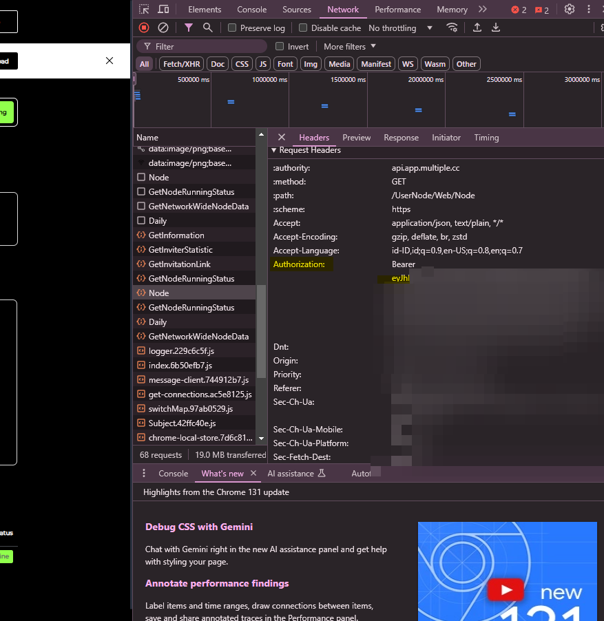

# Multiple.cc Node Monitor Bot

A Telegram bot that monitors Multiple.cc nodes and provides status updates. The bot fetches information about node running status and user details from Multiple.cc's API.

## Features

- 🔒 Secure access with authorized chat ID only
- 📊 Monitor multiple nodes simultaneously
- ⏱️ Real-time running time tracking
- 👤 User information display

## Prerequisites

- Python 3.7+
- Telegram Bot Token (get from [@BotFather](https://t.me/botfather))
- app.multiple.cc Bearer Tokens
- Your Telegram Chat ID (get from [@userinfobot](https://t.me/userinfobot))

## Installation

1. Clone the repository:
```bash
git clone <repository-url>
cd multiplecc-node-monitor
```

2. Install required packages:
```bash
pip install -r requirements.txt
```

3. Set up configuration files:

Create `.env` file with your Telegram bot token and chat ID:
```env
TELEGRAM_BOT_TOKEN=your_telegram_bot_token
CHAT_ID=your_telegram_chat_id
```
Get Bearer token in inspect element > network > search `Node` (Refresh browser if not show) > Copy `eyxxxxx`



Create `token.txt` and add your Multiple.cc API tokens (one per line):
```text
your_first_token
your_second_token
...
```

## Usage

1. Start the bot:
```bash
python main.py
```

2. Available commands in Telegram:
- `/start` - Initialize the bot and see welcome message
- `/info` - Get detailed information about all nodes
- `/help` - Display available commands

## License

This project is licensed under the MIT License - see the LICENSE file for details.

## Disclaimer

This is an unofficial tool and is not affiliated with app.multiple.cc. Use at your own risk.